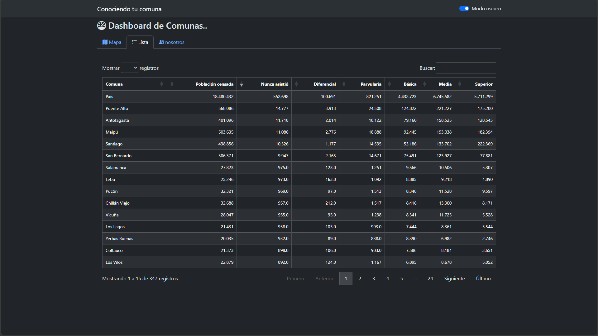
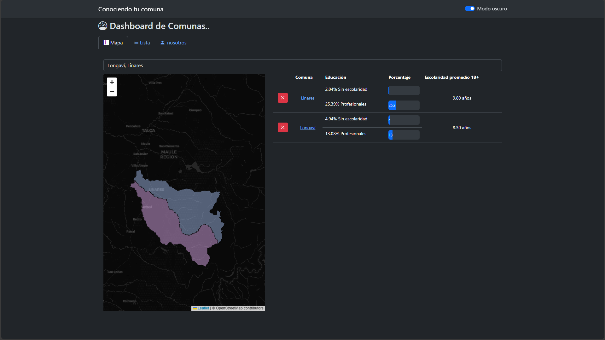
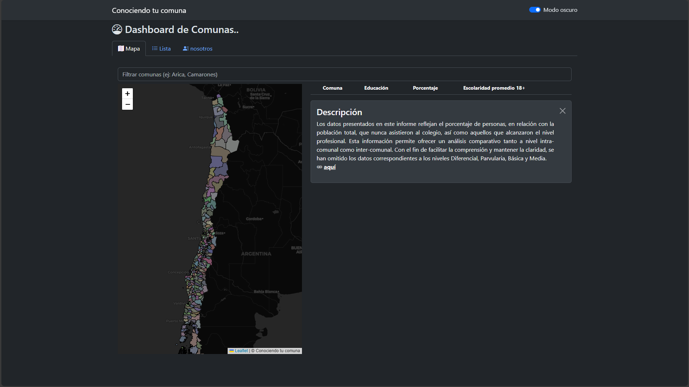

# Conociendo-tu-comuna 🚀 

Este proyecto fue desarrollado con fines académicos e informativos. La información presentada se obtuvo a partir de los datos del Censo 2024 realizado en Chile. Su origen responde a un interés particular, pero se encuentra abierto para toda la comunidad, incluyendo tanto a entidades públicas como privadas.

El panel informativo o dashboard fue construido utilizando diversas tecnologías para el procesamiento, análisis y visualización de datos, entre ellas:

## Tecnologías utilizadas:
- 💻 **Leaflet**
- 💻 **Python**
- 💻 **PHP**
- 💻 **HTML**
- 💻 **JavaScript**
- 💻 **Bootstrap**

## Funcionalidades principales:
- 🛠️ Dashboard interactivo comunal
- 🛠️ Lista de todas las comunas
- 🛠️ Nosotros

## Requisitos del sistema:
1. ⚙️ Servidor web.
2. ⚙️ Navegador web actualizado.

## Instalación:
1. 👨🏻‍💻 Clonar el repositorio.
2. 👨🏻‍💻 Configurar el archivo `config.php`
3. 👨🏻‍💻 Acceder a la aplicación desde el navegador.

## Contacto:
 -seguel.claudio.a@gmail.com
 -+56 9 75310981
 -github.com/ekos77
